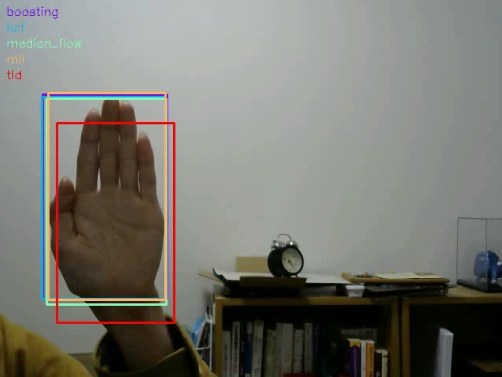

# OpenCV-Tracking
OpenCV(contrib)に実装された物体追跡（トラッキング）を実行するサンプルコードです．

- トラッキング手法
  - boosting
  - MIL
  - KCF
  - TLD
  - Median Flow
  - GOTURN

## How To Use
```
$ python opencv_tracking.py -v [*.mp4] -m [tracking method]
```
- 初期フレームにおいて、追跡対象のbounding boxを指定します．
- トラッキング結果は、JSONファイルとして出力されます．

### 各ソースの説明
- `cap_movie.py`： Webカメラを用いて動画ファイルを生成します．
- `opencv_tracking.py`: 動画に対してトラッキングを実行します．
- `compare_results.py`: 上記で出力された複数手法の結果を全て描画した比較動画を出力します．

### 結果例    


## TODO
- 各手法の概要を追加

## 参考サイト
- OpenCVを用いたトラッキングに関して
  - [Python+OpenCVでWebカメラの画像中のものをトラッキングする話 - EnsekiTT Blog](https://ensekitt.hatenablog.com/entry/2017/12/21/200000)
  - [追跡アルゴリズム (C++/python)情報へのリンク - Qiita](https://qiita.com/nonbiri15/items/76b24a7bd0f9a6ce8b6d)
  - [OpenCV Tracking API について - IrohaLog](http://irohalog.hatenablog.com/entry/opencv_tracking_api)
- OpenCVでの動画の扱い
  - [動画を扱う — OpenCV-Python Tutorials 1 documentation](http://labs.eecs.tottori-u.ac.jp/sd/Member/oyamada/OpenCV/html/py_tutorials/py_gui/py_video_display/py_video_display.html)
  - [OpenCVの動画プロパティを取得する - Qiita](https://qiita.com/takahiro_itazuri/items/e740f0a1b5165fafa6ac)
